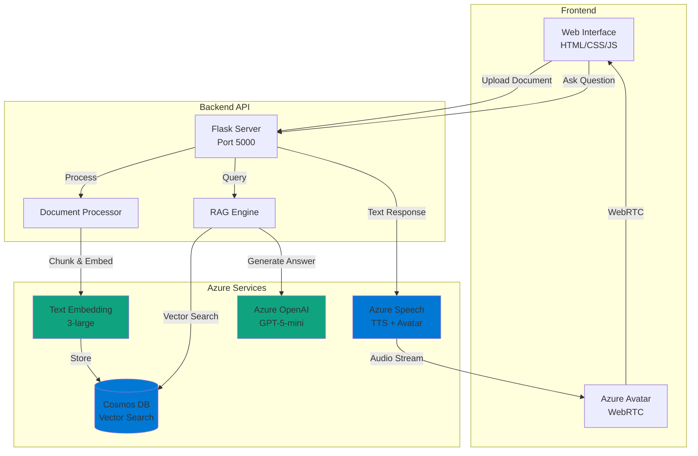

# Azure Avatar RAG 🎭💬

[](https://opensource.org/licenses/MIT)
[](https://www.python.org/downloads/)
[](https://azure.microsoft.com/)

> **Intelligent talking avatar powered by Azure AI services and Retrieval-Augmented Generation (RAG)**

An interactive conversational AI system that combines Azure Speech Services with document-based knowledge retrieval to create an intelligent avatar that can answer questions about uploaded documents with natural voice synthesis and visual representation.

---

## 🎯 What It Does

Upload documents (PDF, DOCX, TXT, MD) and chat with an AI-powered avatar that:
- 🗣️ **Speaks naturally** using Azure Neural Text-to-Speech
- 📚 **Understands your documents** through RAG architecture
- 🧠 **Provides intelligent answers** using Azure OpenAI GPT-5
- 🔍 **Searches semantically** with vector embeddings in Cosmos DB
- 🎭 **Animates realistically** with Azure Avatar services

---

## 🏗️ Architecture



---

## ✨ Key Features

### 🔄 **RAG Pipeline**
- **Document Processing**: Automatic chunking with overlap for context preservation
- **Vector Embeddings**: High-dimensional semantic representations using `text-embedding-3-large`
- **Smart Retrieval**: Top-K similarity search with configurable relevance threshold
- **Context-Aware Generation**: LLM response grounded in retrieved document chunks

### 🎙️ **Multi-Modal Interaction**
- **Avatar Animation**: Realistic facial expressions and lip-sync
- **Neural Voice**: Multi-lingual Azure Neural TTS with natural prosody
- **Visual Feedback**: Real-time avatar status and conversation flow

### 🗄️ **Scalable Storage**
- **Cosmos DB Vector Store**: Native vector search with partition key optimization
- **Session Management**: Persistent conversation history per user
- **Document Metadata**: Structured indexing for efficient retrieval

### 🛡️ **Enterprise-Ready**
- **Error Handling**: Graceful degradation and retry mechanisms
- **Logging**: Structured logging with configurable levels
- **Configuration**: Environment-based secrets management
- **CORS Support**: Secure cross-origin requests

---

## 🚀 Quick Start

### Prerequisites

- Python 3.11+
- Azure subscription with:
  - Azure OpenAI Service
  - Azure Speech Services
  - Azure Cosmos DB (NoSQL API)

### Installation

1. **Clone the repository**
```bash
git clone https://github.com/larusso94/azure-avatar-rag.git
cd azure-avatar-rag
```

2. **Create virtual environment**
```bash
python -m venv .venv
source .venv/bin/activate  # Linux/Mac
# .venv\Scripts\activate    # Windows
```

3. **Install dependencies**
```bash
pip install -r requirements.txt
```

4. **Configure environment**

Create `.env` file:
```env
# Azure OpenAI
AZURE_OPENAI_ENDPOINT=https://YOUR-RESOURCE.openai.azure.com/
AZURE_OPENAI_API_KEY=your-api-key
AZURE_OPENAI_DEPLOYMENT_CHAT=gpt-5-mini-deployment
AZURE_OPENAI_DEPLOYMENT_EMBED=text-embedding-3-large

# Azure Speech
AZURE_SPEECH_KEY=your-speech-key
AZURE_SPEECH_REGION=swedencentral

# Cosmos DB
COSMOS_ENDPOINT=https://YOUR-ACCOUNT.documents.azure.com:443/
COSMOS_KEY=your-cosmos-key
COSMOS_DATABASE=avatarrag
COSMOS_CONTAINER_KB=knowledge_base
```

5. **Configure frontend (for avatar)**

Edit `index.html` (lines 17-19) with your Azure Speech credentials:
```html
<input id="region" type="hidden" value="YOUR_AZURE_REGION" />
<input id="APIKey" type="hidden" value="YOUR_AZURE_SPEECH_KEY" />
```

See [Frontend Configuration Guide](docs/FRONTEND_CONFIG.md) for details and security best practices.

### Running the Application

**Option 1: Automated Script**
```bash
chmod +x start.sh
./start.sh
```

**Option 2: Manual (2 terminals)**
```bash
# Terminal 1 - Backend API
python app.py

# Terminal 2 - Frontend Server
python server.py
```

Access the application at: **http://localhost:9090/index.html**

---

## 📖 Usage

### 1. Upload Documents
- Click "Choose File" and select PDF, DOCX, TXT, or MD
- Click "📤 Upload" to process
- Wait for chunking and embedding (progress shown)

### 2. Start Avatar Session
- Click "▶️ Start Session" to initialize WebRTC connection
- Avatar will appear and be ready to speak

### 3. Ask Questions
- Enable "Use RAG (Knowledge Base)" checkbox
- Type your question in the text field
- Click "❓ Ask Question"
- Avatar will respond with voice and animation

### Example Questions
```
- What is the main topic of the document?
- Summarize the key points
- What does it say about [specific topic]?
- Explain the concept of [concept]
- List the recommendations mentioned
```

---

## 🧩 Project Structure

```
azure-avatar-rag/
├── backend/                 # Backend logic
│   ├── config.py           # Configuration management
│   ├── cosmos_db.py        # Cosmos DB client + vector ops
│   ├── embedder.py         # OpenAI embedding generation
│   ├── chunker.py          # Document chunking strategies
│   ├── chat.py             # RAG orchestration
│   └── processor.py        # Document processing pipeline
├── css/
│   └── styles.css          # UI styling
├── js/
│   ├── basic.js            # Avatar WebRTC integration
│   └── rag.js              # Frontend RAG UI logic
├── uploads/                # Temporary file storage
├── app.py                  # Flask API server
├── server.py               # Static file server
├── index.html              # Main UI
├── requirements.txt        # Python dependencies
├── .env.example            # Environment template
└── README.md               # This file
```

---

## 🔧 Configuration

### Avatar Settings
Edit `config.json`:
```json
{
  "avatar": {
    "character": "lisa",           // lisa, james, sara
    "style": "casual-sitting",     // casual-sitting, technical-standing
    "voice": "en-US-AvaMultilingualNeural"
  }
}
```

### RAG Parameters
Adjust in `backend/chat.py`:
```python
# Retrieval
TOP_K_RESULTS = 3
SIMILARITY_THRESHOLD = 0.7

# Generation
MAX_TOKENS = 500
TEMPERATURE = 0.7
```

---

## 🏢 Architecture Decisions

### Why These Technologies?

| Component | Technology | Rationale |
|-----------|-----------|-----------|
| **LLM** | Azure OpenAI GPT-5 | Latest model with improved reasoning, lower cost |
| **Embeddings** | text-embedding-3-large | High-dimensional (3072), better semantic understanding |
| **Vector Store** | Cosmos DB | Native vector search, global distribution, low latency |
| **TTS** | Azure Neural Speech | Multi-lingual, natural prosody, real-time streaming |
| **Avatar** | Azure Avatar Services | Production-ready, WebRTC support, realistic animation |

### Design Patterns

- **RAG Pattern**: Retrieval-augmented generation for grounded responses
- **Modular Architecture**: Separation of concerns (processing, storage, generation)
- **Async Operations**: Non-blocking I/O for document upload and processing
- **Stateless API**: Session management in Cosmos DB for horizontal scaling

---

## 📊 Performance

- **Document Processing**: ~2-5 seconds per page (PDF)
- **Vector Search**: <100ms for top-3 retrieval
- **Response Generation**: ~1-3 seconds (depends on context length)
- **Avatar TTS**: Real-time streaming with <200ms latency

---

## 🛠️ Development

### Running Tests
```bash
pytest tests/ -v
```

### Debugging
```bash
# Enable debug logging
export LOG_LEVEL=DEBUG
python app.py
```

### API Health Check
```bash
curl http://localhost:5000/api/health
```

---

## 🚧 Roadmap

- [ ] Multi-session support with user authentication
- [ ] Support for additional document formats (Excel, PowerPoint)
- [ ] Advanced chunking strategies (semantic, sliding window)
- [ ] Conversation memory and context management
- [ ] Evaluation metrics (retrieval accuracy, response quality)
- [ ] Cost optimization (caching, model selection)
- [ ] Deployment guides (Azure Container Apps, AKS)

---

## 🤝 Contributing

Contributions welcome! Please:
1. Fork the repository
2. Create a feature branch (`git checkout -b feature/amazing-feature`)
3. Commit changes (`git commit -m 'Add amazing feature'`)
4. Push to branch (`git push origin feature/amazing-feature`)
5. Open a Pull Request

---

## 📄 License

This project is licensed under the MIT License - see [LICENSE](LICENSE) file for details.

---

## 🙏 Acknowledgments

- **Azure AI Services** for providing robust cloud AI infrastructure
- **LangChain** community for RAG pattern inspiration
- **Microsoft Learn** for comprehensive documentation

---

## 📧 Contact

**Lautaro Russo**
- LinkedIn: [linkedin.com/in/lautaro-russo](https://www.linkedin.com/in/lautaro-russo/)
- Email: lrussobertolez@gmail.com
- Portfolio: [github.com/larusso94/larusso94](https://github.com/larusso94/larusso94)

---

<div align="center">

**Built with ❤️ using Azure AI**

[⭐ Star this repo](https://github.com/larusso94/azure-avatar-rag) | [🐛 Report Bug](https://github.com/larusso94/azure-avatar-rag/issues) | [💡 Request Feature](https://github.com/larusso94/azure-avatar-rag/issues)

</div>
